# TinyJoypad → Vircon32

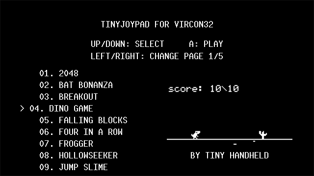

A single [Vircon32](https://www.vircon32.com/) cartridge that ports **50
games** originally written for the [TinyJoypad](https://www.tinyjoypad.com/)
ATtiny85 + SSD1306 128x64 OLED handheld onto Vircon32's 640x360 GPU, behind
one shared game-select menu. Vircon32's GPU is a texture-region blitter with
no CPU-writable framebuffer, so every game's display output is routed
through a 256-tile "column atlas" (one pre-baked texture tile per possible
SSD1306 byte value) instead of writing pixels directly - see `CLAUDE.md` for
the full architecture writeup, porting log, and every bug found along the
way.

This port was built with the help of Claude AI (Anthropic) - the shim
layer, every individual game port, bug fixes, and the optimization passes
documented in `CLAUDE.md`/`OPTIMIZATIONS.md` were all done through an
AI-assisted development workflow.

## Controls

Vircon32 is a fantasy console with its own abstract gamepad (D-pad + 6
buttons + Start) - the games in this cartridge only ever use a small part
of that:

| Console input | Used for |
|---|---|
| D-pad | Move / navigate the menu |
| Button 1 ("A"/Fire) | Confirm, jump, shoot, rotate, etc. - context-sensitive per game |
| Button 2 ("B") | Secondary action - only Tiny Minez uses this (instant flag-toggle, as an alternative to holding Button 1) |
| Button 3 ("X") | Toggle a pixel-grid overlay on/off - only while a game is actually running (no effect on the menu) |
| Button 4 ("Y") | Toggle sound on/off globally - works on the menu, mid-game, and during the quit-confirmation dialog |
| Start | Pause mid-game and open the quit-confirmation dialog (YES/NO, defaults to NO) |

Which physical keyboard key or real gamepad button maps to which of
these is entirely up to the Vircon32 emulator's own input configuration
(`Config-Controls.xml` in the desktop emulator, or the equivalent in
whichever emulator/frontend is used) - this cartridge doesn't fix or
assume a specific keyboard layout, the same way a real console game
doesn't. See [vircon32.com](https://www.vircon32.com/) for the emulator's
own default bindings and how to change them.

## License

This project is **GPLv3** (`LICENSE.txt`), because at least one ported
game (Tiny Invaders v4.2) is itself GPLv3, and combining GPLv3 code into
one cartridge binary makes the cartridge as a whole a GPLv3 combined work.
This covers this project's own new code (the shim layer, the menu,
`portVircon32.c`, etc.) - each individual game's own original
license/attribution is preserved unmodified in its own header comment in
`src/games/`, and is also listed per-game in the table below.

## Games

Click a thumbnail for the full-size screenshot.

| Game (in-cartridge title) | Original Author | License | High Score Saved | Source | Screenshot |
|---|---|---|---|---|---|
| 2048 | Obono | MIT | — | [TinyJoypadWorks](https://github.com/obono/TinyJoypadWorks) | [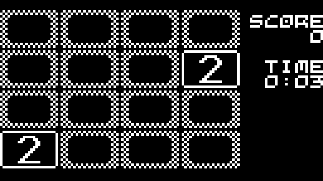](metadata/screenshots/2048.png) |
| Astro Barrier | Sean Price | GPLv3 | ✅ | [attiny-astro-barrier](https://github.com/SeanP2001/attiny-astro-barrier) |  |
| ATtiny Snake | Sean Price | GPLv3 | ✅ | [attiny-snake](https://github.com/SeanP2001/attiny-snake) |  |
| ATtiny Tetromino | Sunpazed | GPLv3 | ✅ | [attiny-tetromino](https://github.com/sunpazed/attiny-tetromino) |  |
| Bat Bonanza | Andy Jackson | Non-commercial, with attribution | — | [Attiny-Arduino-Games](https://github.com/andyhighnumber/Attiny-Arduino-Games) |  |
| Blocks Gold | Andy Jackson / Jarosław Mazurkiewicz | Non-commercial | ✅ | [ATtiny-Tetris-Gold](https://github.com/jaromaz/ATtiny-Tetris-Gold) |  |
| Breakout | Ilya Titov | Non-commercial, with attribution | ✅ | [AttinyArcade](https://github.com/webboggles/AttinyArcade) | [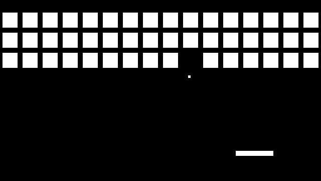](metadata/screenshots/BREAKOUT.png) |
| Dino Game | tiny-handheld project (original) | None specified | — | [tiny-handheld](https://github.com/Yevgeniy-Olexandrenko/tiny-handheld) |  |
| Falling Blocks | Andy Jackson | Non-commercial, with attribution | ✅ | [Attiny-Arduino-Games](https://github.com/andyhighnumber/Attiny-Arduino-Games) |  |
| Flappy Bird | Alex Wulff | None specified | — | [Instructables](https://www.instructables.com/Flappy-Bird-on-ATtiny85-and-OLED-Display-SSD1306/) |  |
| Four in a Row | Unknown | None specified | — | [tiny-handheld](https://github.com/Yevgeniy-Olexandrenko/tiny-handheld) |  |
| Frogger | Andy Jackson (art: @senkunmusashi) | Non-commercial, with attribution | ✅ | [Attiny-Arduino-Games](https://github.com/andyhighnumber/Attiny-Arduino-Games) | [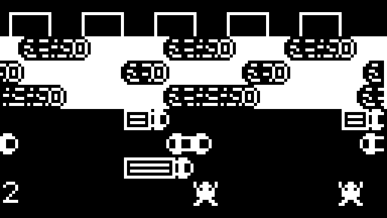](metadata/screenshots/FROGGER.png) |
| HollowSeeker | Obono | MIT | — | [TinyJoypadWorks](https://github.com/obono/TinyJoypadWorks) | [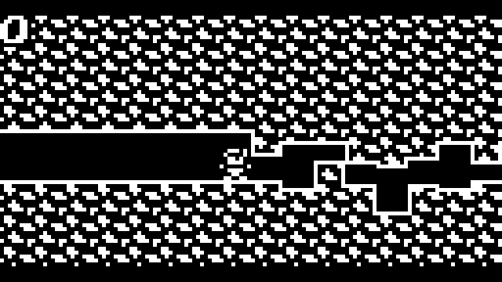](metadata/screenshots/HOLLOWSEEKER.png) |
| Jump Slime | Kondolab (近藤さんちの研究室) | None specified | — | [note.com/kondolab](https://note.com/kondolab/n/ndc93ac31e555) |  |
| Laser Pong | Winston Lu | MIT | — | [ATTiny85_Pong](https://github.com/Winston-Lu/ATTiny85_Pong) |  |
| Meteor Storm | Albert Gonzalez | Unlicense (public domain) | — | [attiny85_microgame_meteor_storm](https://github.com/theisolinearchip/attiny85_microgame_meteor_storm) |  |
| NumberPlace | Obono | MIT | — | [TinyJoypadWorks](https://github.com/obono/TinyJoypadWorks) | [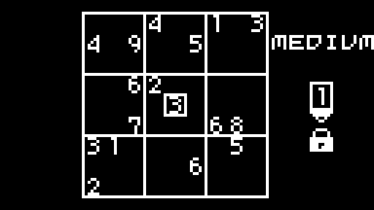](metadata/screenshots/NUMBERPLACE.png) |
| Oroboros | Ilya Titov | Non-commercial, with attribution | ✅ | [AttinyArcade](https://github.com/webboggles/AttinyArcade) | [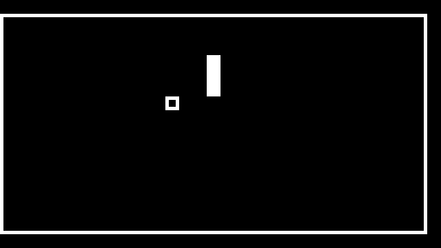](metadata/screenshots/OROBOROS.png) |
| Pipe Bird | Ioannis Lampropoulos | None specified | ✅ | [attiny85-flappy-bird](https://github.com/Lampropoulosss/attiny85-flappy-bird) |  |
| Run Dude Run | Ilya Titov | Non-commercial, with attribution | ✅ | [AttinyArcade](https://github.com/webboggles/AttinyArcade) |  |
| SnakeGame85 | terezaza | GPLv3 | — | [SnakeGame85](https://github.com/terezaza/SnakeGame85) | [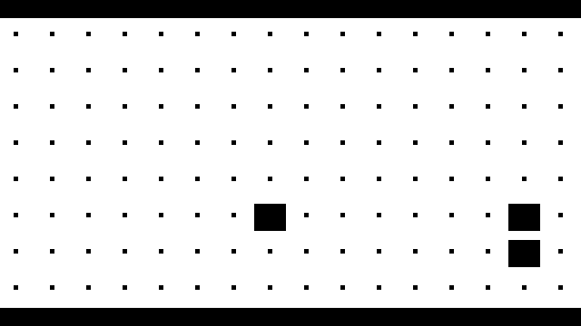](metadata/screenshots/SNAKEGAME85.png) |
| Space Attack | Andy Jackson | Non-commercial, with attribution | ✅ | [Attiny-Arduino-Games](https://github.com/andyhighnumber/Attiny-Arduino-Games) |  |
| Stacker | Andy Jackson | Non-commercial, with attribution | ✅ | [Attiny-Arduino-Games](https://github.com/andyhighnumber/Attiny-Arduino-Games) | [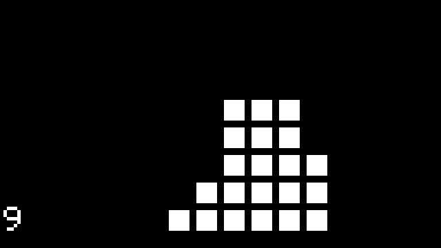](metadata/screenshots/STACKER.png) |
| Tiny Arena | Daniel C | GPLv3 | — | [tinyjoypad.com](https://www.tinyjoypad.com/tinyjoypad_attiny85) |  |
| Tiny Arkanoid | Daniel Champagne | GPLv3 | — | [tinyjoypad.com](https://www.tinyjoypad.com/tinyjoypad_attiny85) |  |
| Tiny Bert | Daniel C | GPLv3 | ✅ | [tinyjoypad.com](https://www.tinyjoypad.com/tinyjoypad_attiny85) |  |
| Tiny Bike | Daniel C | GPLv3 | — | [tinyjoypad.com](https://www.tinyjoypad.com/tinyjoypad_attiny85) |  |
| Tiny Bomber | Daniel C | GPLv3 | — | [tinyjoypad.com](https://www.tinyjoypad.com/tinyjoypad_attiny85) |  |
| Tiny Bulls And Cows | Datacute | MIT | — | [TinyBullsAndCows](https://github.com/datacute/TinyBullsAndCows) |  |
| Tiny DDug | Daniel C | GPLv3 | — | [tinyjoypad.com](https://www.tinyjoypad.com/tinyjoypad_attiny85) |  |
| Tiny Doc | Daniel C | GPLv3 | — | [tinyjoypad.com](https://www.tinyjoypad.com/tinyjoypad_attiny85) |  |
| Tiny Dungeon | Sven B / Lorandil | MIT | — | [TinyDungeon](https://github.com/Lorandil/TinyDungeon) |  |
| TinY Fi | Kondolab (近藤さんちの研究室) | None specified | — | [note.com/kondolab](https://note.com/kondolab/n/n2c96413eaa23) |  |
| Tiny Gilbert | Daniel C | GPLv3 | — | [tinyjoypad.com](https://www.tinyjoypad.com/tinyjoypad_attiny85) |  |
| Tiny Invaders | Daniel C / Sven B | GPLv3 | ✅ | [Tiny-invaders-v4.2](https://github.com/Lorandil/Tiny-invaders-v4.2) |  |
| Tiny Lander | Roger Buehler (tscha70) | GPLv3 | — | [TinyLanderV1.0](https://github.com/tscha70/TinyLanderV1.0) |  |
| Tiny Mania | Daniel C | GPLv3 | — | [tinyjoypad.com](https://www.tinyjoypad.com/tinyjoypad_attiny85) |  |
| Tiny Minez | Sven B / Lorandil | GPLv3 | — | [TinyMinez](https://github.com/Lorandil/TinyMinez) |  |
| Tiny Missile | Daniel C | GPLv3 | — | [tinyjoypad.com](https://www.tinyjoypad.com/tinyjoypad_attiny85) |  |
| Tiny Morpion | Daniel C | GPLv3 | — | [tinyjoypad.com](https://www.tinyjoypad.com/tinyjoypad_attiny85) |  |
| Tiny Pacman | Daniel C | GPLv3 | — | [tinyjoypad.com](https://www.tinyjoypad.com/tinyjoypad_attiny85) |  |
| Tiny Pinball | Daniel C | GPLv3 | — | [tinyjoypad.com](https://www.tinyjoypad.com/tinyjoypad_attiny85) |  |
| Tiny Pipe | Daniel C | GPLv3 | — | [tinyjoypad.com](https://www.tinyjoypad.com/tinyjoypad_attiny85) |  |
| Tiny Plaque | Daniel C | GPLv3 | — | [tinyjoypad.com](https://www.tinyjoypad.com/tinyjoypad_attiny85) |  |
| Tiny SQuest | Daniel C | GPLv3 | — | [tinyjoypad.com](https://www.tinyjoypad.com/tinyjoypad_attiny85) |  |
| Tiny Trick | Daniel C | GPLv3 | — | [tinyjoypad.com](https://www.tinyjoypad.com/tinyjoypad_attiny85) |  |
| Tiny Tris | Daniel C | GPLv3 | ✅ | [tinyjoypad.com](https://www.tinyjoypad.com/tinyjoypad_attiny85) |  |
| TinyRoG | Kondolab (近藤さんちの研究室) | None specified | — | [note.com/kondolab](https://note.com/kondolab/n/n1806e4234495) | [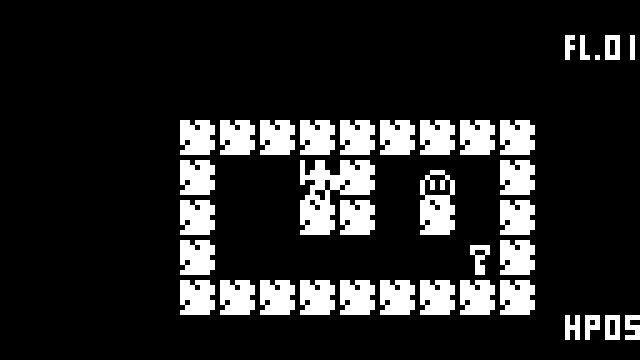](metadata/screenshots/TINYROG.png) |
| UFO | Ilya Titov | Non-commercial, with attribution | ✅ | [AttinyArcade](https://github.com/webboggles/AttinyArcade) | [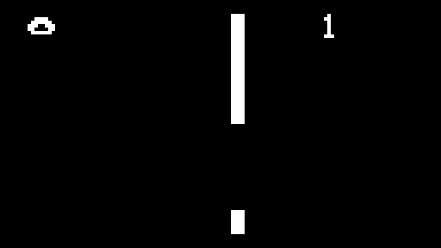](metadata/screenshots/UFO.png) |
| Wren Rollercoaster | Andy Jackson | Non-commercial, with attribution | ✅ | [Attiny-Arduino-Games](https://github.com/andyhighnumber/Attiny-Arduino-Games) |  |

## Optimizations

Vircon32 runs a fixed 15 MHz / 60 fps / 250,000-CPU-cycles-per-frame
budget - several ports needed real optimization work to stay under it,
mostly the same recurring shape (per-pixel work redone every frame
instead of cached, or a self-gated function still costing a full call
every time it's invoked). See [OPTIMIZATIONS.md](OPTIMIZATIONS.md) for a
short per-game summary of what was done.

## Building

See `Make.sh`/`Make.bat` (requires the Vircon32 dev tools - `compile`,
`assemble`, `png2vircon`, `wav2vircon`, `packrom` - on `PATH`) and
`CLAUDE.md` for the full architecture and porting notes.
